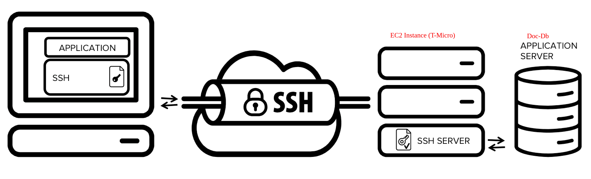

# DocDb remote Acess Demo (MongoDB compatible) 

## How It Works

This demo shows how to remotely programmatically (using nodejs) access a docDb cluster from Outside an Amazon VPC.It uses ssh tunnel transport method, that requires you to have a *proxy* EC2 instance that can acess the DocDb cluster.For more details of how this works see [connect-from-outside-a-vpc](https://docs.aws.amazon.com/documentdb/latest/developerguide/connect-from-outside-a-vpc.html)

## 